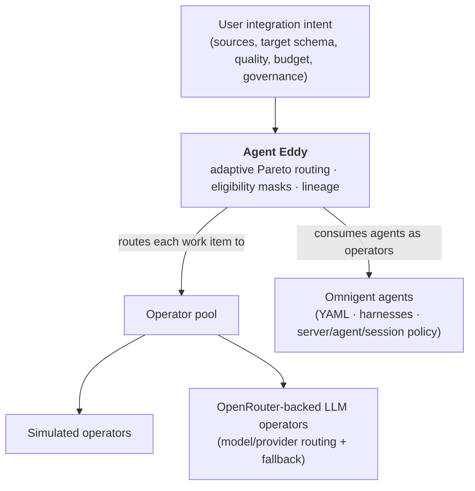
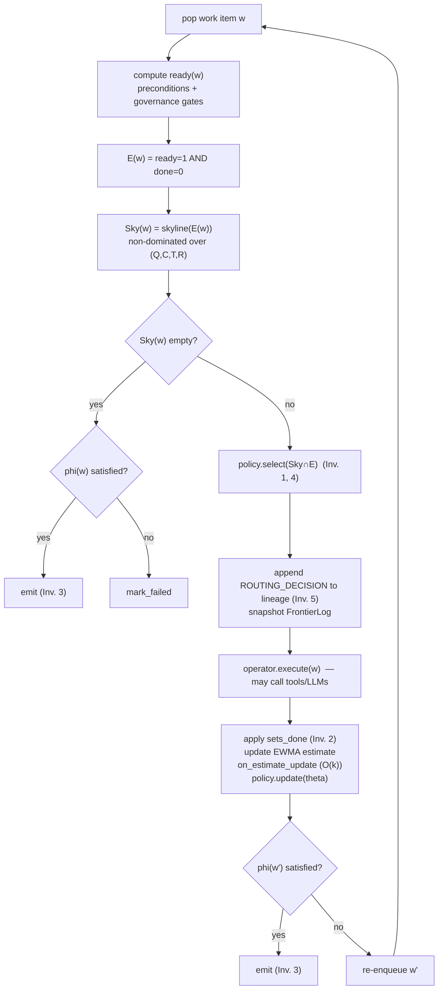
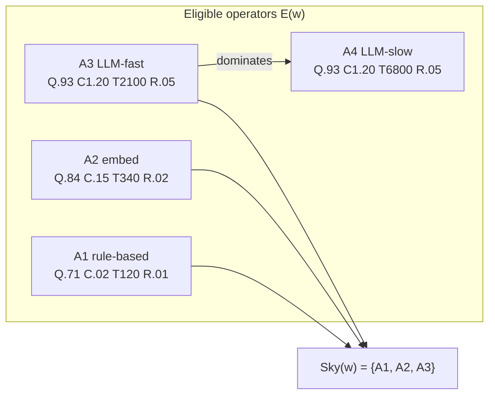
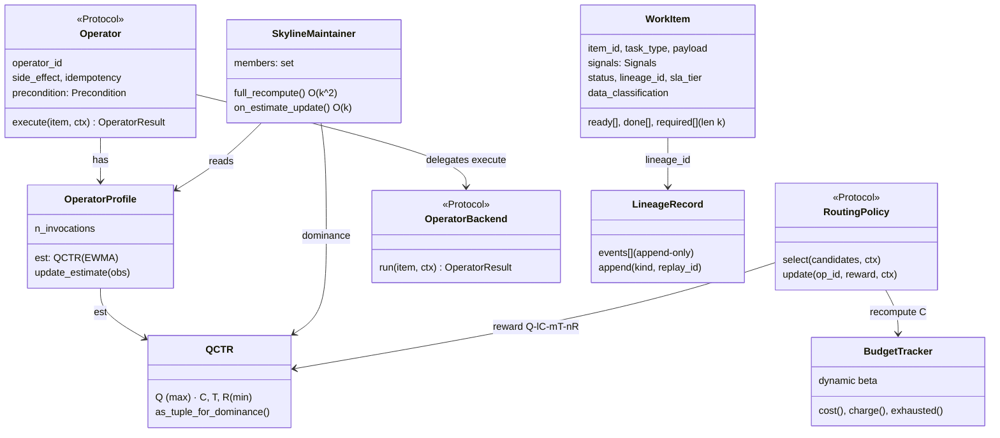
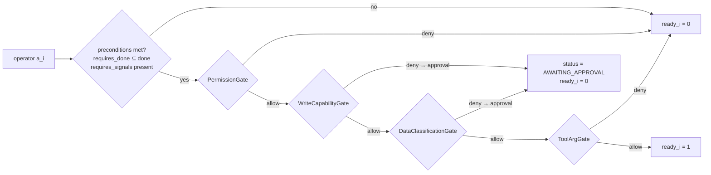

# Agent Eddy Router — Diagrams

Mermaid + ASCII diagrams for [`DESIGN.md`](DESIGN.md). Mermaid blocks render on GitHub and in
most Markdown previewers.

---

## 1. Layering — where Agent Eddy sits



- OpenRouter = model/provider layer (below). Omnigent = execution + governance substrate
  (beside). Agent Eddy = the adaptive multi-objective routing layer both lack.

---

## 2. Main loop (Algorithm 1)



---

## 3. Skyline over (Q, C, T, R)

Two dimensions shown (Quality ↑ vs. Cost ↓); the runtime maintains all four. An operator is on
the skyline iff no eligible operator is no-worse on all dims and strictly better on one.

```
 Quality Q
   ^
   |            x A3 (LLM-fast)         . = dominated (off skyline)
   |          /                          x = skyline member
   |        x A2 (embed)
   |       /
   |     x A1 (rule-based)
   |    /        . A4 (LLM-slow: same Q,C as A3 but worse T -> dominated)
   |   /
   +----------------------------------> Cost C  (lower is better -> left)

 Sky(w) = { A1, A2, A3 };   A4 excluded (dominated by A3).
 As budget depletes, beta rises -> C of token-heavy A3 grows -> A3 can leave the skyline.
```



---

## 4. Core data model relationships



---

## 5. Governance gate chain (computing ready(w))


